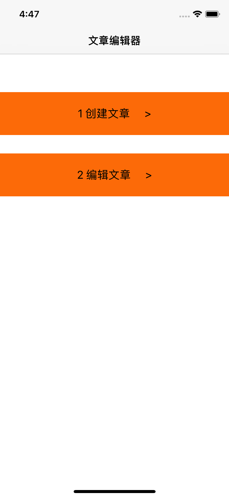
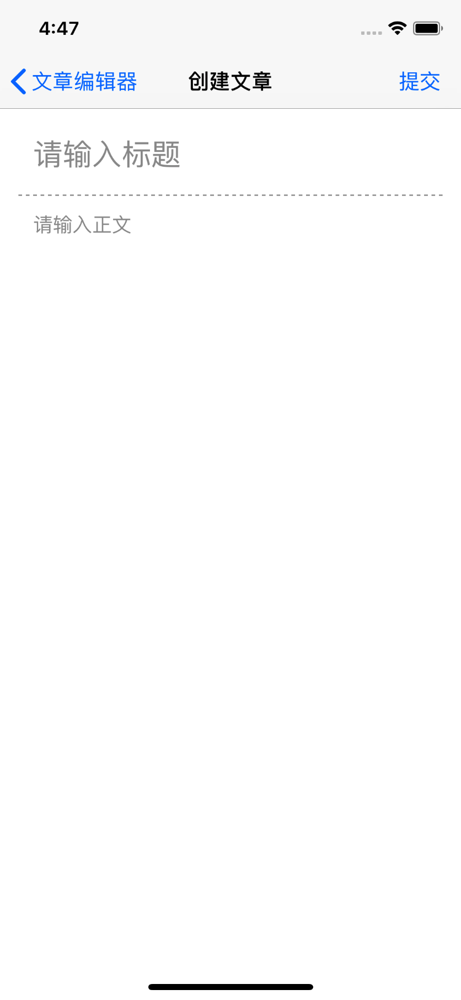
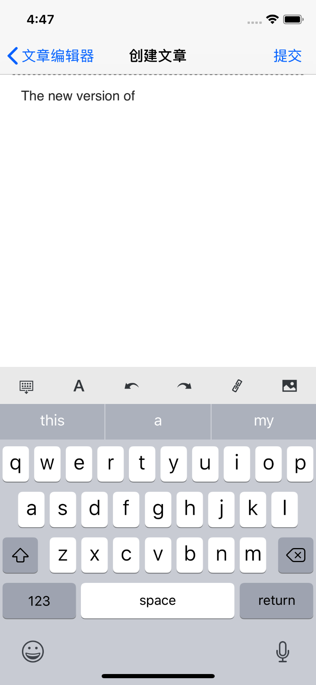
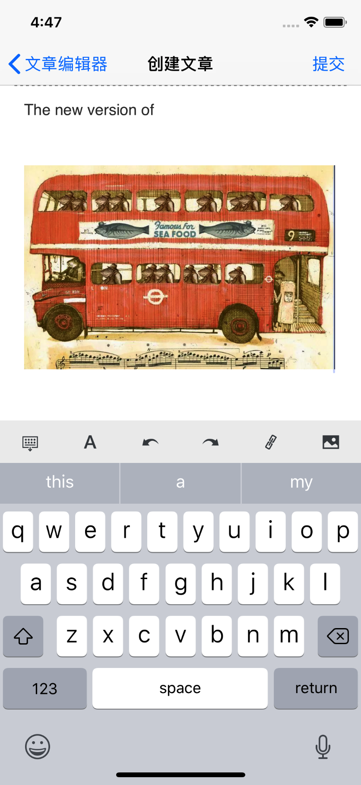
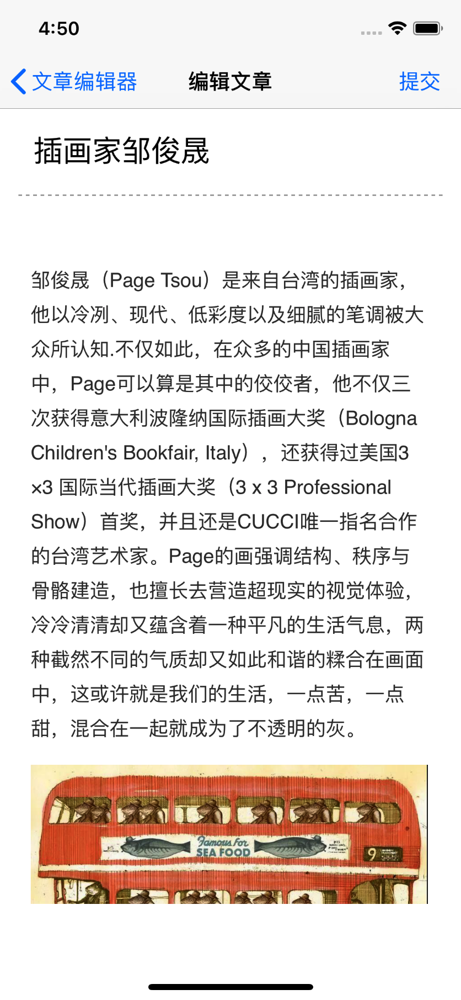
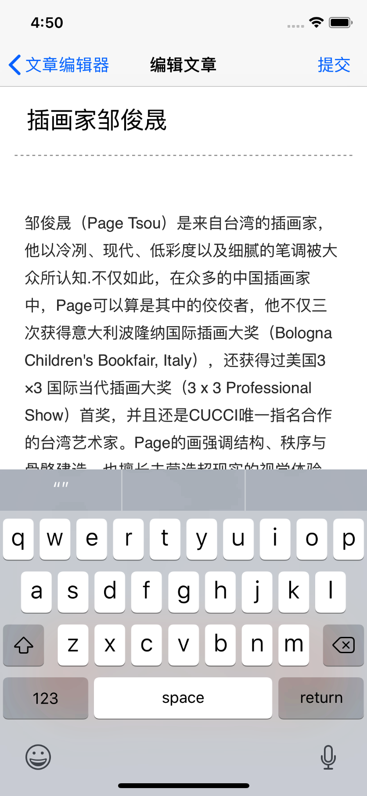
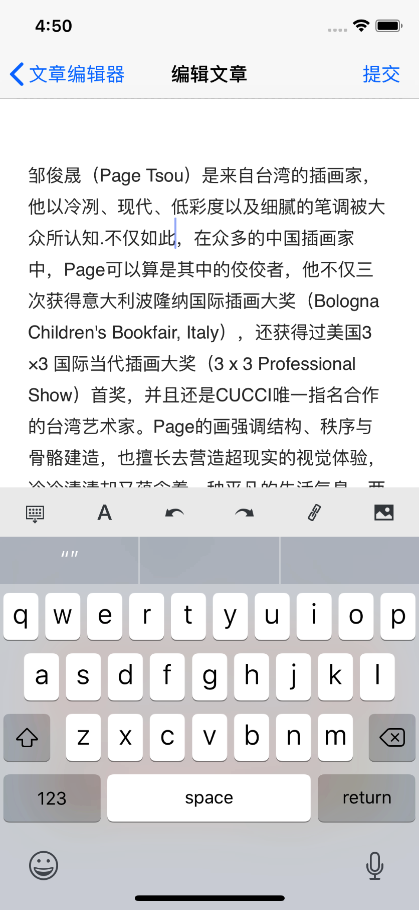

# HtmlEditer-UIWebView
最近搜索一个网页编辑器[WGEditor-mobile]( https://github.com/study123456/WGEditor-mobile) ,自己根据需要,修改部分功能.

功能(通过UIWebView编辑,修改html,导出html,不是富文本格式):

* 创建文章,编辑文字和图片
* 编辑文章,修改文字和图片

网页编辑器,富文本,图文编辑,发布文章功能

### 1 创建文章

</img>

</img>

</img>

</img>

### 2 编辑文章

</img>

</img>

</img>

